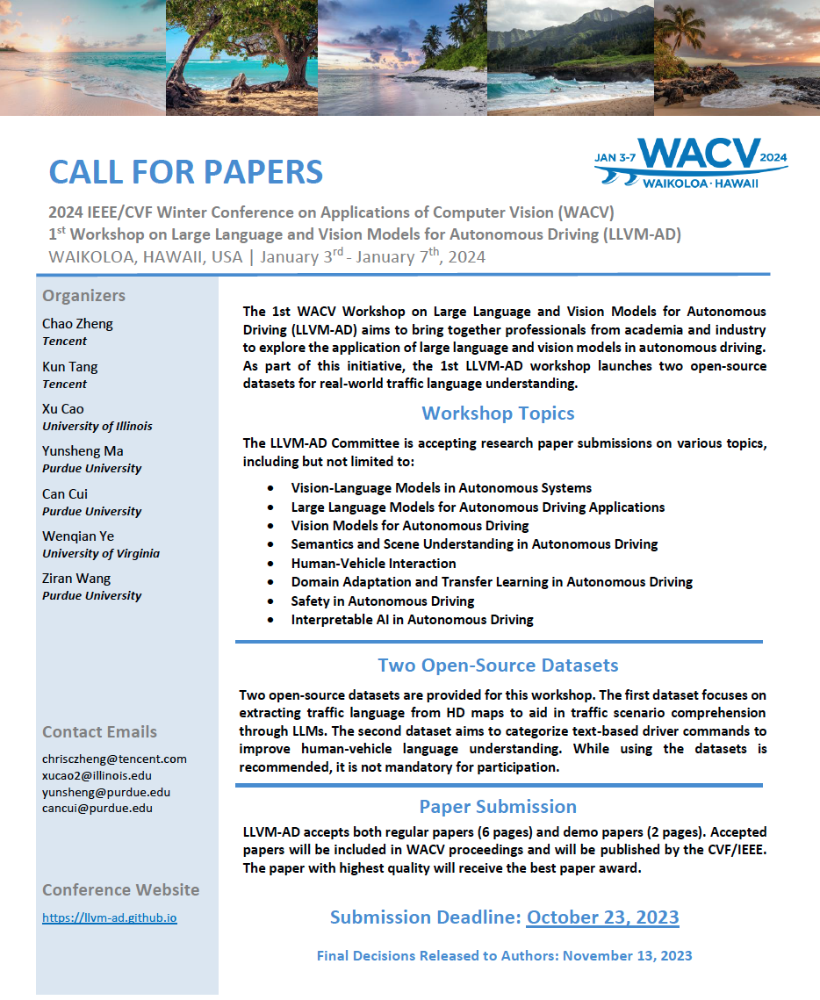
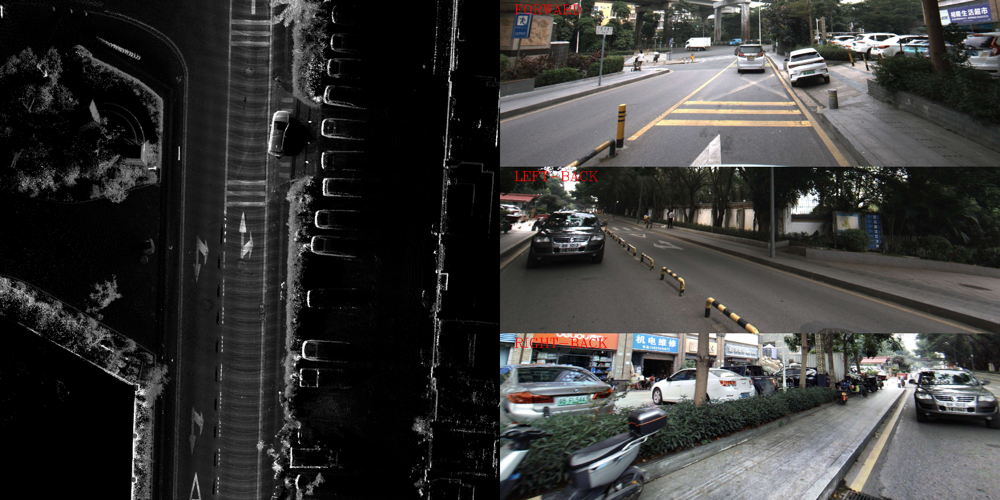
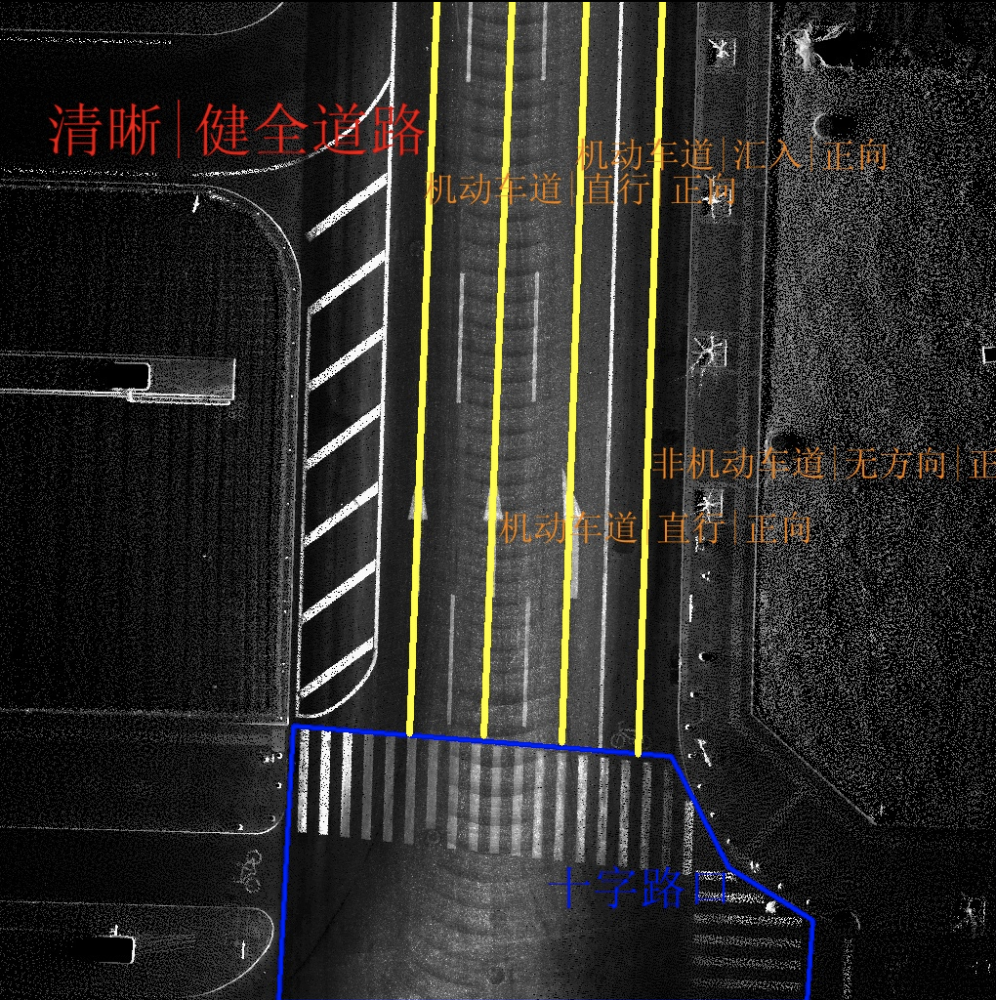
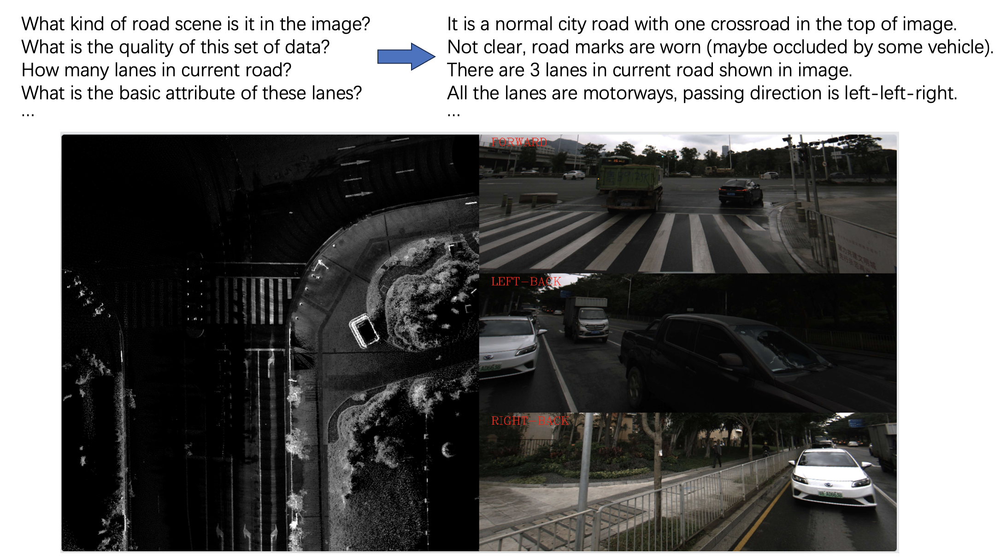

# MAPLM: A Large-Scale Vision-Language Dataset for Map and Traffic Scene Understanding

### [中文简介](./README-zh.md)

#### - WACV 2024自动驾驶大语言视觉模型研讨会（LLVM-AD）



## 研讨会介绍
WACV全称：Winter Conference on Applications of Computer Vision，是领域内著名的计算机视觉应用会议之一，每年举办一次。本次发起的“自动驾驶大语言视觉模型研讨会”，全称：1st Workshop on Large Language and Vision Models for Autonomous Driving (LLVM-AD)，由腾讯地图联合PediaMed AI实验室, 伊利诺伊大学厄巴纳-香槟分校、普渡大学以及弗吉尼亚大学共同举办，针对计算机视觉、模式识别、自动驾驶、高精度地图等一系列领域的议题，组织论文投稿，比赛及获奖分享，将在WACV 2024期间举行。本次研讨会旨在汇集学术界和工业界的专业人士，探索大型语言和视觉模型在自动驾驶以及高精地图中的应用。
作为研讨会计划的一部分，我们将发布两个开源数据集，用于实现对真实世界交通语言理解的研究。

## 特色数据集·MAPLM     
腾讯地图HD Map自动化团队、伊利诺伊大学厄巴纳-香槟分校、普渡大学以及弗吉尼亚大学联合推出了业界首个多模态语言+视觉（点云BEV+环视图像）交通场景理解数据集：MAPLM。MAPLM提供丰富的道路场景图像资料，并配套多个层级的场景描述信息，让模型学会处理更复杂多变的交通环境。
### 场景资料：MAPLM提供了包含高速、快速路、城市道路、乡村道路在内的各类交通场景图像资料，配合丰富的路口场景。每一帧数据资料包括两个部分：    
✧点云BEV：3D点云在BEV视角下的投影图，图像清晰，分辨率高    
✧环视图像：广角相机拍摄的前视、左后、右后三个方向的高分辨率照片    
### 描述标签：    
✧要素级：车道线、地面标志、停止线、路口区域等    
✧车道级：车道类型、通行方向、转向类别等    
✧道路级：场景类型、道路数据质量、路口结构等    
### 数据资料展示：    
点云BEV图+3张环视影像，注环视影像为4096*3000的竖幅照片，下图仅为裁切后的示例    



### 标签展示：    
下图展示了其中一帧的标签信息，包含三个部分：道路级信息（红色字体）、车道级信息（黄色几何线+橙色字体）、路口信息（蓝色多边形+蓝色字体）      



## 研讨会任务和收益介绍   

依托上述数据集中丰富的道路交通场景信息，我们设计了基于ScienceQA的自然语言与图像结合的问答任务。    
### 任务介绍：
我们提供以下数据或先验输入：    
✓点云BEV图像：3D点云在BEV视角下的投影图    
✓环视影像：广角相机，每帧包含前视，左后，右后三个拍摄角度    
✓投影转换参数：每帧数据照片与点云图像的透视投影转换参数     
任务问题形式：针对各个维度的标签，我们会随机提供对应标签的自然语言问题，标签维度包括但不限于场景类型，车道个数及属性信息，是否包含路口等。具体示例如下：     

    

    

### 参与方式：
✓欢迎视觉，多模态融合，自动驾驶，高精度地图以及相关领域的研究者或从业者参与challenge。     
✓除Workshop比赛内容外，我们还会邀请一些嘉宾进行相关议题的Presentation，欢迎有兴趣的小伙伴保持关注并参与这次Workshop进行文章的发表。    
✓本次workshop论文征集和比赛表现优秀的在校学生，可优先获得腾讯地图感知算法岗实习机会。     
✓比赛相关的内容还在筹备中，欢迎随时关注我们的workshop主页。     


## 引用      
如果代码、数据集和Workshop背后的研究工作对您有启发，请引用我们：    
```
@inproceedings{tang2023thma,
  title={THMA: tencent HD Map AI system for creating HD map annotations},
  author={Tang, Kun and Cao, Xu and Cao, Zhipeng and Zhou, Tong and Li, Erlong and Liu, Ao and Zou, Shengtao and Liu, Chang and Mei, Shuqi and Sizikova, Elena and Zheng, Chao},
  booktitle={Proceedings of the AAAI Conference on Artificial Intelligence},
  volume={37},
  number={13},
  pages={15585--15593},
  year={2023}
}
```

```
@article{zheng2023hdmap,
  title={High-Definition Map Automatic Annotation System Based on Active Learning},
  author={Zheng, Chao and Cao, Xu and Tang, Kun and Cao, Zhipeng and Sizikova, Elena and Zhou, Tong and Li, Erlong and Liu, Ao and Zou, Shengtao and Yan, Xinrui and Mei, Shuqi},
  journal={AI Magazine},
  year={2023},
  publisher={Wiley Online Library}
}
```


